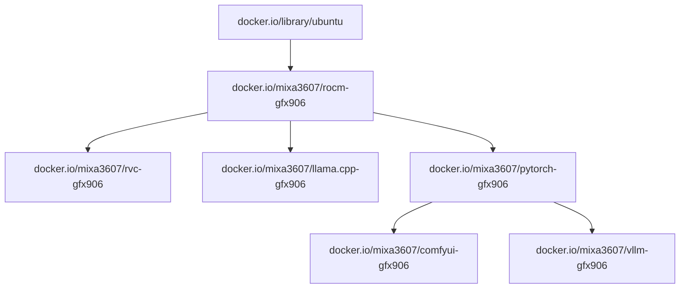

# ML software for deprecated GFX906 arch

)

## Docs
https://arkprojects.space/wiki/AMD_GFX906

## Prebuild images

### Images

| Name         | About                 | Status                                                                                                                                                       | Docs                               |
| ------------ | --------------------- | ------------------------------------------------------------------------------------------------------------------------------------------------------------ | ---------------------------------- |
| ROCm         | ROCm patched images   |           | [readme](./rocm/readme.md)         |
| ROCm RVS     | ROCm Validation Suite | OK                                                                                                                                                           | [readme](./rocm-validation-suite/readme.md)     |
| ROCm tensile | gfx906 tensile files  | Deprecated                                                                                                                                                   | [readme](./rocm-tensile/readme.md) |
| PyTorch      | PyTorch images        | OK                                                                                                                                                           | [readme](./pytorch/readme.md)      |
| llama.cpp    | llama.cpp images      |  | [readme](./llama.cpp/readme.md)    |
| ComfyUI      | ComfyUI images        |        | [readme](./comfyui/readme.md)      |
| vLLM         | vLLM images           | OK                                                                                                                                                           | [readme](./vllm-v2/readme.md)      |

### Deps graph

