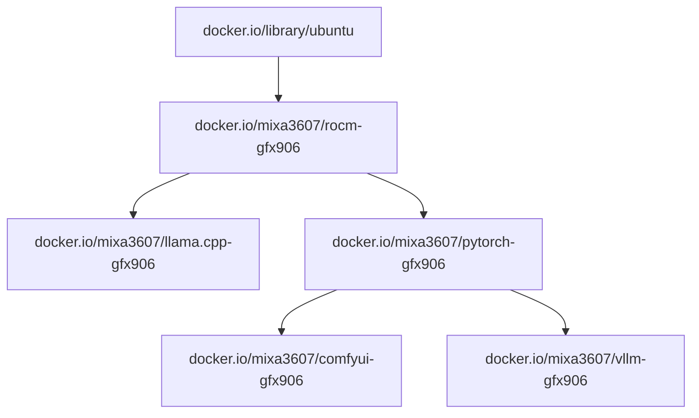

# ML software for deprecated GFX906 arch

## Docs

https://arkprojects.space/wiki/AMD_GFX906

## Prebuild images

> Legacy builds (pre-TheRock) are **no longer supported** starting from the
> `20260802001858` release. If you are stuck on an old build (e.g. `6.3.3`)
> because of issues with the new TheRock builds, please
> [open an issue](https://github.com/mixa3607/ML-gfx906/issues).

### Images

| Name             | About                   | Status                                                                                                                                                       | Docs                                        |
| ---------------- | ----------------------- | ------------------------------------------------------------------------------------------------------------------------------------------------------------ | ------------------------------------------- |
| ROCm             | ROCm patched images     |           | [readme](./rocm/README.md)                  |
| ROCm RVS         | ROCm Validation Suite   | OK                                                                                                                                                           | [readme](./rocm-validation-suite/README.md) |
| ROCm TB          | ROCm TransferBench      | OK                                                                                                                                                           | [readme](./rocm-transfer-bench/README.md)   |
| AMD Memory Tweak | AMD HBM2 timing tool    | OK                                                                                                                                                           | [readme](./amd-memory-tweak/README.md)      |
| AMD Tuning       | Tool for AMD GPU tuning | OK                                                                                                                                                           | [readme](./amd-tuning/README.md)            |
| ROCm tensile     | gfx906 tensile files    | Deprecated                                                                                                                                                   | [readme](./rocm-tensile/readme.md)          |
| PyTorch          | PyTorch images          |        | [readme](./pytorch/README.md)               |
| llama.cpp        | llama.cpp images        |  | [readme](./llama.cpp/README.md)             |
| ComfyUI          | ComfyUI images          |        | [readme](./comfyui/README.md)               |
| vLLM             | vLLM images             | Paused                                                                                                                                                       | [readme](./vllm-v2/README.md)               |

### Deps graph

