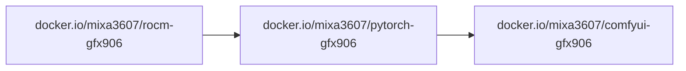

# ComfyUI GFX906

The most powerful and modular diffusion model GUI, API and backend with a
graph/nodes interface. https://github.com/Comfy-Org/ComfyUI

All images are built for the deprecated `gfx906` GPU architecture and are
**not** compatible with other AMD GPUs.

## Dependencies

The image is built on top of the [PyTorch image](../pytorch/README.md), which
itself is based on the [ROCm image](../rocm/README.md):



`ComfyUI` is cloned from the upstream repo at build time (pinned to a git tag),
so the base ROCm/PyTorch versions are fixed per image tag.

## Prebuilt images

- [`docker.io/mixa3607/comfyui-gfx906:<ver>-rocm-7.14`](https://hub.docker.com/r/mixa3607/comfyui-gfx906/tags?name=rocm-7.14)\*

> \* have daily builds. See last tag on Docker Hub.

## Run

### Docker

The image needs ROCm device access. Example:

```bash
docker run --rm \
  --device=/dev/kfd --device=/dev/dri \
  --group-add video --group-add render \
  -p 8188:8188 \
  -e PERSISTENCE_PATH=/data \
  -v $(pwd)/data:/data \
  docker.io/mixa3607/comfyui-gfx906:<ver>-rocm-7.14
```

Environment variables:

| Variable           | Description                                                                 |
| ------------------ | --------------------------------------------------------------------------- |
| `PERSISTENCE_PATH` | Copy `models`, `custom_nodes`, `input`, `output` there; use it as `--base-directory` and store the SQLite DB |
| `VENV_NAME`        | Create/activate a virtual environment (with `--system-site-packages`) at `/data/<venv>` (with persistence) or `/comfyui/<venv>` |
| `BOOTSTRAP_ONLY`   | Set to `1` to only prepare persistence/venv and exit without starting ComfyUI |

Behavior:

- Always runs with `--enable-manager`
- With `PERSISTENCE_PATH` set, data and the SQLite database
  (`sqlite:///<PERSISTENCE_PATH>/database/comfyui.db`) are persisted to the
  mounted volume
- Additional CLI args can be appended to the `docker run` command

Also see https://github.com/hartmark/sd-rocm/blob/main/docker-compose.yml

### Kubernetes

Helm chart and samples: [mixa3607 charts](https://github.com/mixa3607/charts)

## Build from source

The build happens inside `docker buildx` on top of the PyTorch base image
(`docker.io/mixa3607/pytorch-gfx906:<torch>-rocm-<rocm>`) and produces the
ComfyUI image.

| Artifact | Script                    | Dockerfile               |
| -------- | ------------------------- | ------------------------ |
| Image    | `./build-and-push.image.sh` | `./build-image.Dockerfile` |

### Prerequisites

- Docker with the `buildx` plugin
- Access to the PyTorch base image (see the [pytorch subproject](../pytorch/README.md))

### Presets

Preset files set the ComfyUI, PyTorch and ROCm versions. Source one, then run
the build script:

```bash
. preset.v0.30.0-rocm-7.14.sh
./build-and-push.image.sh
```

To update the preset to the latest ComfyUI release, run `./upd2last-release.sh`.

### Build variables

Defaults come from [`env.sh`](./env.sh) and [`../env.sh`](../env.sh). Export
any variable to override it.

| Variable                 | Default                             | Description                                  |
| ------------------------ | ----------------------------------- | -------------------------------------------- |
| `COMFYUI_IMAGE`          | `docker.io/mixa3607/comfyui-gfx906` | Destination image name                       |
| `COMFYUI_TORCH_IMAGE`    | `docker.io/mixa3607/pytorch-gfx906` | PyTorch base image name                      |
| `COMFYUI_ROCM_VERSION`   | `6.3.3`                             | ROCm version of the base image               |
| `COMFYUI_PYTORCH_VERSION`| `v2.7.1`                            | PyTorch version of the base image            |
| `COMFYUI_REPO`           | `https://github.com/Comfy-Org/ComfyUI.git` | ComfyUI git repository               |
| `COMFYUI_BRANCH`         | `master`                            | ComfyUI git tag/branch to build              |
| `COMFYUI_COMMIT`         | *(empty)*                           | Pin a specific commit (on top of the branch) |
| `COMFYUI_PUSH`           | `1`                                 | Push the image to the registry               |
| `COMFYUI_FORCE_BUILD`    | *(unset)*                           | Set to `1` to rebuild even if the tag exists |
| `REPO_GIT_REF`           | *(git tag, else short SHA)*         | Build revision appended to the tag           |

The base image is resolved as
`$COMFYUI_TORCH_IMAGE:v$COMFYUI_PYTORCH_VERSION-rocm-$COMFYUI_ROCM_VERSION`
(e.g. `docker.io/mixa3607/pytorch-gfx906:v2.13.0-rocm-7.14`).

### Build the image

```bash
. preset.v0.30.0-rocm-7.14.sh
./build-and-push.image.sh
```

Five tags are created:

- `$COMFYUI_IMAGE:$BRANCH-torch-$PYTORCH_VERSION-rocm-$ROCM_VERSION-$REPO_GIT_REF` — pinned to the build revision
- `$COMFYUI_IMAGE:$BRANCH-torch-$PYTORCH_VERSION-rocm-$ROCM_VERSION`
- `$COMFYUI_IMAGE:$BRANCH-rocm-$ROCM_VERSION-$REPO_GIT_REF` — pinned to the build revision
- `$COMFYUI_IMAGE:$BRANCH-rocm-$ROCM_VERSION`
- `$COMFYUI_IMAGE:latest-rocm-$ROCM_VERSION`

The build is skipped if the pinned tag is already in the registry, unless
`COMFYUI_FORCE_BUILD=1`.

The build log is saved to `./logs/build_<timestamp>.log`.

### Push

Set `COMFYUI_PUSH=0` to keep the image local (no `--push` passed to buildx).

### Custom registry / local overrides

Example:

```bash
export COMFYUI_ROCM_VERSION=7.14
export COMFYUI_PYTORCH_VERSION=2.13.0
export COMFYUI_BRANCH=v0.30.0
export COMFYUI_IMAGE=registry.example.com/apps/comfyui-gfx906
export COMFYUI_TORCH_IMAGE=registry.example.com/apps/pytorch-gfx906
./build-and-push.image.sh
```

See [`../.env-local.sh`](../.env-local.sh) for a ready-made local override file.

## Benchmarks

| ROCm  | Comfy   | PyTorch | Preset                             | Batch | Time (s) | Notes                           |
| ----- | ------- | ------- | ---------------------------------- | ----- | -------- | ------------------------------- |
| 7.14  | v0.30.0 | v2.13.0 | SD 1.5                             | 1     | 3.5      |                                 |
| 7.14  | v0.30.0 | v2.13.0 | SD 1.5                             | 2     | 6.7      |                                 |
| 6.4.4 | v0.3.63 | v2.7.1  | SDXL                               | 1     | 33       |                                 |
| 6.4.4 | v0.3.63 | v2.7.1  | SDXL                               | 2     | 65       |                                 |
| 6.4.4 | v0.3.63 | v2.7.1  | SD 1.5                             | 1     | 3.8      |                                 |
| 6.4.4 | v0.3.63 | v2.7.1  | SD 1.5                             | 2     | 7        |                                 |
| 6.3.3 | v0.3.63 | v2.7.1  | SDXL                               | 1     | 33       |                                 |
| 6.3.3 | v0.3.63 | v2.7.1  | SDXL                               | 2     | 65       |                                 |
| 6.3.3 | v0.3.63 | v2.7.1  | SD 1.5                             | 1     | 3.8      |                                 |
| 6.3.3 | v0.3.63 | v2.7.1  | SD 1.5                             | 2     | 7        |                                 |
| 7.0.2 | v0.3.63 | v2.7.1  | 03_video_wan2_2_14B_i2v_subgraphed | 1     | 4522     | PowerLimit 200; TdcLimitGfx 160 |
| 7.0.2 | v0.3.65 | v2.9.0  | video_wan2_2_14B_t2v               | 1     | 1265     | PowerLimit 200; TdcLimitGfx 160 |
| 7.0.2 | v0.3.65 | v2.9.0  | video_wan2_2_14B_t2v               | 2     | 1762     | PowerLimit 200; TdcLimitGfx 160 |

## Prebuilt images (legacy builds)

- [`docker.io/mixa3607/comfyui-gfx906:<ver>-rocm-6.3.3`](https://hub.docker.com/r/mixa3607/comfyui-gfx906/tags?name=rocm-6.3.3)
- [`docker.io/mixa3607/comfyui-gfx906:<ver>-rocm-7.2.1`](https://hub.docker.com/r/mixa3607/comfyui-gfx906/tags?name=rocm-7.2.1)
