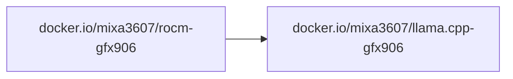

# llama.cpp GFX906

LLM inference in C/C++. https://github.com/ggml-org/llama.cpp

All images are built for the deprecated `gfx906` GPU architecture and are
**not** compatible with other AMD GPUs.

## Dependencies

The image is built on top of the [ROCm image](../rocm/README.md):



`llama.cpp` is cloned from the upstream repo at build time (pinned to a git tag), so the ROCm version is fixed per image tag.

## Prebuilt images

- [`docker.io/mixa3607/llama.cpp-gfx906:<ver>-rocm-7.14`](https://hub.docker.com/r/mixa3607/llama.cpp-gfx906/tags?name=rocm-7.14)\*
- [`docker.io/mixa3607/llama.cpp-gfx906:<ver>-rocm-7.14-mxxm`](https://hub.docker.com/r/mixa3607/llama.cpp-gfx906/tags?name=rocm-7.14-mxxm)\*

> \* have daily builds. See last tag on Docker Hub.

Also see [llamacpp-offload-calculator](./llamacpp-offload-calculator/readme.md)

## Build from source

The build happens inside `docker buildx` on top of the ROCm base image
(`docker.io/mixa3607/rocm-gfx906:<rocm>-complete`) and produces the llama.cpp image.

| Artifact | Script                      | Dockerfile                 |
| -------- | --------------------------- | -------------------------- |
| Image    | `./build-and-push.image.sh` | `./build-image.Dockerfile` |

### Prerequisites

- Docker with the `buildx` plugin
- Access to the ROCm base image (see the [rocm subproject](../rocm/README.md))

### Presets

Preset files set the llama.cpp, ROCm and other versions. Source one, then run the build script:

```bash
. preset.b10288-rocm-7.14-ggml.sh
./build-and-push.image.sh
```

To update the presets to the latest llama.cpp release, run `./upd2last-release.sh`.

### Build variables

Defaults come from [`env.sh`](./env.sh) and [`../env.sh`](../env.sh) plus the
[rocm `env.sh`](../rocm/env.sh). Export any variable to override it.

| Variable                | Default                                     | Description                                        |
| ----------------------- | ------------------------------------------- | -------------------------------------------------- |
| `LLAMA_IMAGE`           | `docker.io/mixa3607/llama.cpp-gfx906`       | Destination image name                             |
| `LLAMA_ROCM_VERSION`    | `7.14`                                      | ROCm version of the base image                     |
| `LLAMA_REPO`            | `https://github.com/ggml-org/llama.cpp.git` | llama.cpp git repository                           |
| `LLAMA_BRANCH`          | `master`                                    | llama.cpp git tag/branch to build                  |
| `LLAMA_COMMIT`          | _(empty)_                                   | Pin a specific commit (on top of the branch)       |
| `LLAMA_CMAKE_HIP_FLAGS` | _(empty)_                                   | Extra HIP flags appended to the build              |
| `LLAMA_CCACHE_MAXSIZE`  | `2G`                                        | ccache size limit; ccache is mounted across builds |
| `LLAMA_IS_RELEASE`      | `0`                                         | `1` — full tags; otherwise `-pre` tag only         |
| `LLAMA_PUSH`            | `1`                                         | Push the image to the registry                     |
| `LLAMA_FORCE_BUILD`     | _(unset)_                                   | Set to `1` to rebuild even if the tag exists       |
| `ROCM_ARCH`             | `gfx906`                                    | Target GPU architecture (from `../rocm/env.sh`)    |
| `ROCM_IMAGE`            | `docker.io/mixa3607/rocm-gfx906`            | ROCm base image name (from `../rocm/env.sh`)       |
| `REPO_GIT_REF`          | _(git tag, else short SHA)_                 | Build revision appended to the tag                 |

The base image is resolved as
`$ROCM_IMAGE:$LLAMA_ROCM_VERSION-complete` (e.g. `docker.io/mixa3607/rocm-gfx906:7.14-complete`).

The build uses `ccache` (max size `LLAMA_CCACHE_MAXSIZE`, default 2G) mounted
via a BuildKit cache so rebuilds reuse compiled objects.

### Build the image

```bash
. preset.b10288-rocm-7.14-ggml.sh
./build-and-push.image.sh
```

With `LLAMA_IS_RELEASE=1` two tags are created:

- `$LLAMA_IMAGE:$LLAMA_PRESET_NAME-$REPO_GIT_REF` — pinned to the build revision
- `$LLAMA_IMAGE:$LLAMA_PRESET_NAME` — floating tag

Otherwise (`LLAMA_IS_RELEASE=0`, default) only one pre-release tag is created:

- `$LLAMA_IMAGE:$LLAMA_PRESET_NAME-$REPO_GIT_REF-pre`

The build is skipped if the pinned tag is already in the registry, unless `LLAMA_FORCE_BUILD=1`.

The build log is saved to `./logs/build_<timestamp>.log`.

### Push

Set `LLAMA_PUSH=0` to keep the image local (no `--push` passed to buildx).

### Custom registry / local overrides

Example:

```bash
export LLAMA_ROCM_VERSION=7.14
export LLAMA_BRANCH=b10219
export LLAMA_IMAGE=registry.example.com/apps/llama.cpp-gfx906
export ROCM_IMAGE=registry.example.com/apps/rocm-gfx906
./build-and-push.image.sh
```

See [`../.env-local.sh`](../.env-local.sh) for a ready-made local override file.
