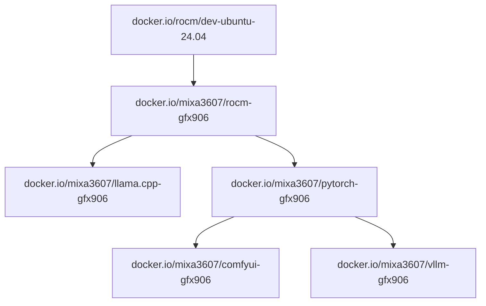
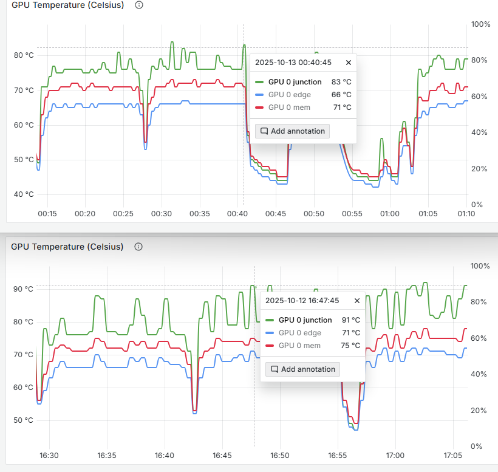

# ML software for deprecated GFX906 arch

## Prebuild images
### Images
| Name | Source | Status | Docs |
| ---- | ------ | ------ | ---- |
| ROCm | [ROCm](https://github.com/ROCm/ROCm), [rocBLAS](https://github.com/ROCm/rocBLAS) | OK | [readme](./rocm/readme.md) |
| PyTorch | [torch](https://github.com/pytorch/pytorch), [vision](https://github.com/pytorch/vision), [audio](https://github.com/pytorch/audio) | OK | [readme](./pytorch/readme.md) |
| llama.cpp | [llama.cpp](https://github.com/ggml-org/llama.cpp) | OK | [readme](./llama.cpp/readme.md) |
| ComfyUI | [ComfyUI](https://github.com/comfyanonymous/ComfyUI) | OK | [readme](./comfyui/readme.md) |
| VLLM | [VLLM](https://github.com/nlzy/vllm-gfx906), [triton](https://github.com/nlzy/triton-gfx906) | OK | [readme](./vllm/readme.md) |


| Project    |    | Image |
| ---------- | -- | ----- |
| ROCm       | ╦═ | `docker.io/mixa3607/rocm-gfx906:7.1.0-complete` |
|            | ╠═ | `docker.io/mixa3607/rocm-gfx906:7.0.2-complete` |
|            | ╠═ | `docker.io/mixa3607/rocm-gfx906:7.0.0-complete` |
|            | ╠═ | `docker.io/mixa3607/rocm-gfx906:6.4.4-complete` |
|            | ╚═ | `docker.io/mixa3607/rocm-gfx906:6.3.3-complete` |
| PyTorch    | ╦═ | `docker.io/mixa3607/pytorch-gfx906:v2.7.1-rocm-6.4.4` |
|            | ╠═ | `docker.io/mixa3607/pytorch-gfx906:v2.7.1-rocm-6.3.3` |
|            | ╠═ | `docker.io/mixa3607/pytorch-gfx906:v2.8.0-rocm-6.4.4` |
|            | ╠═ | `docker.io/mixa3607/pytorch-gfx906:v2.8.0-rocm-6.3.3` |
|            | ╠═ | `docker.io/mixa3607/pytorch-gfx906:v2.9.0-rocm-6.4.4` |
|            | ╠═ | `docker.io/mixa3607/pytorch-gfx906:v2.9.0-rocm-6.3.3` |
|            | ╚═ | `docker.io/mixa3607/pytorch-gfx906:v2.9.0-rocm-7.0.2` |
| ComfyUI    | ╦═ | `docker.io/mixa3607/comfyui-gfx906:v0.3.67-torch-v2.9.0-rocm-7.0.2` |
|            | ╠═ | `docker.io/mixa3607/comfyui-gfx906:v0.3.67-torch-v2.9.0-rocm-6.4.4` |
|            | ╚═ | `docker.io/mixa3607/comfyui-gfx906:v0.3.67-torch-v2.9.0-rocm-6.3.3` |
| vLLM       | ╦═ | `docker.io/mixa3607/vllm-gfx906:0.11.0-rocm-6.3.3` |
|            | ╠═ | `docker.io/mixa3607/vllm-gfx906:0.10.2-rocm-6.3.3` |
|            | ╚═ | `docker.io/mixa3607/vllm-gfx906:0.8.5-rocm-6.3.3`  |
| llama.cpp  | ╦═ | `docker.io/mixa3607/llama.cpp-gfx906:full-b6924-rocm-7.1.0` |
|            | ╚═ | `docker.io/mixa3607/llama.cpp-gfx906:full-b6924-rocm-6.3.3` |


### Deps graph


## Perf tuning
Changing smcPPTable/TdcLimitGfx 350 => 150 reduced the hotspot by 10+- degrees with almost no drop in performance in vllm ([table in vllm](./vllm/readme.md#benchmarks))

```console
$ upp -p /sys/class/drm/card${GPU_ID}/device/pp_table set --write smcPPTable/TdcLimitGfx=150
Changing smcPPTable.TdcLimitGfx of type H from 330 to 150 at 0x1fe
Committing changes to '/sys/class/drm/card1/device/pp_table'.
```


## Environment
[env v1](./docs/setup.v1.md)

## RVS
```shell
apt update && apt install -y rocm-validation-suite
echo 'actions:
- name: gst-581Tflops-4K4K8K-rand-bf16
  device: all
  module: gst
  log_interval: 10000
  ramp_interval: 5000
  duration: 120000
  hot_calls: 1000
  copy_matrix: false
  target_stress: 581000
  matrix_size_a: 4864
  matrix_size_b: 4096
  matrix_size_c: 8192
  matrix_init: rand
  data_type: bf16_r
  lda: 8320
  ldb: 8320
  ldc: 4992
  ldd: 4992
  transa: 1
  transb: 0
  alpha: 1
  beta: 0' > ~/gst-581Tflops-4K4K8K-rand-bf16.conf
/opt/rocm/bin/rvs -c ~/gst-581Tflops-4K4K8K-rand-bf16.conf
```


