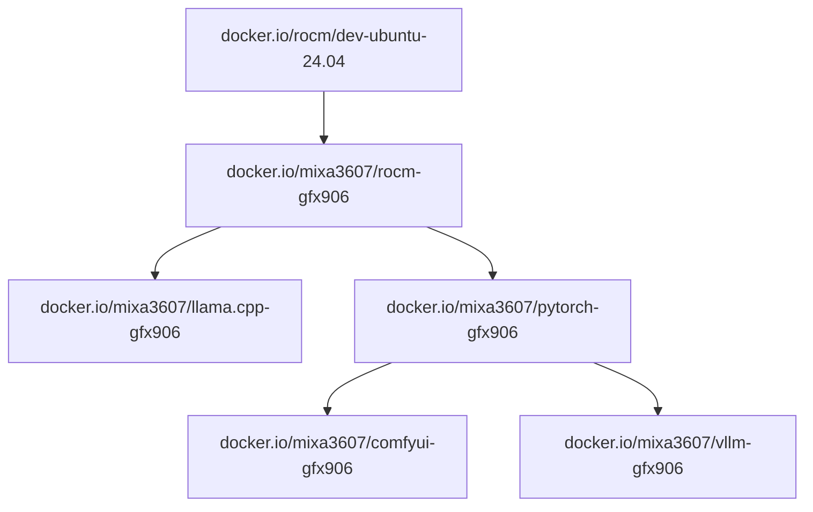

# ML software for deprecated GFX906 arch

## Prebuild images

### Images

| Name         | About                | Status | Docs                               |
| ------------ | -------------------- | ------ | ---------------------------------- |
| ROCm         | ROCm patched images  | OK     | [readme](./rocm/readme.md)         |
| ROCm-tensile | gfx906 tensile files | OK     | [readme](./rocm-tensile/readme.md) |
| PyTorch      | PyTorch images       | OK     | [readme](./pytorch/readme.md)      |
| llama.cpp    | llama.cpp images     | OK     | [readme](./llama.cpp/readme.md)    |
| ComfyUI      | ComfyUI images       | OK     | [readme](./comfyui/readme.md)      |
| VLLM         | vLLM images          | OK     | [readme](./vllm/readme.md)         |

| Project   | Image                                                                      |
| --------- | -------------------------------------------------------------------------- |
| ROCm      | `docker.io/mixa3607/rocm-gfx906:6.3.3-complete`                            |
|           | `docker.io/mixa3607/rocm-gfx906:6.4.4-complete`                            |
|           | `docker.io/mixa3607/rocm-gfx906:7.0.0-complete`                            |
|           | `docker.io/mixa3607/rocm-gfx906:7.0.2-complete`                            |
|           | `docker.io/mixa3607/rocm-gfx906:7.1.0-complete`                            |
|           | `docker.io/mixa3607/rocm-gfx906:7.1.1-complete`                            |
|           | `docker.io/mixa3607/rocm-gfx906:7.2.0-complete`                            |
| --------- | -----------------------------------------------------------                |
| PyTorch   | `docker.io/mixa3607/pytorch-gfx906:v2.7.1-rocm-6.4.4`                      |
|           | `docker.io/mixa3607/pytorch-gfx906:v2.7.1-rocm-6.3.3`                      |
|           | `docker.io/mixa3607/pytorch-gfx906:v2.8.0-rocm-6.4.4`                      |
|           | `docker.io/mixa3607/pytorch-gfx906:v2.8.0-rocm-6.3.3`                      |
|           | `docker.io/mixa3607/pytorch-gfx906:v2.9.0-rocm-6.4.4`                      |
|           | `docker.io/mixa3607/pytorch-gfx906:v2.9.0-rocm-6.3.3`                      |
|           | `docker.io/mixa3607/pytorch-gfx906:v2.9.0-rocm-7.0.2`                      |
|           | `docker.io/mixa3607/pytorch-gfx906:v2.10.0-rocm-6.3.3`                     |
|           | `docker.io/mixa3607/pytorch-gfx906:v2.10.0-rocm-7.2.0`                     |
|           | `docker.io/mixa3607/pytorch-gfx906:v2.11.0rc3-rocm-6.3.3`                  |
|           | `docker.io/mixa3607/pytorch-gfx906:v2.11.0rc3-rocm-7.2.0`                  |
| --------- | -----------------------------------------------------------                |
| ComfyUI   | `docker.io/mixa3607/comfyui-gfx906:v0.17.0-rocm-6.3.3`                     |
|           | `docker.io/mixa3607/comfyui-gfx906:v0.17.0-rocm-7.0.2`                     |
| --------- | -----------------------------------------------------------                |
| vLLM      | `docker.io/mixa3607/vllm-gfx906:0.11.0-rocm-6.3.3-nlzy`                    |
|           | `docker.io/mixa3607/vllm-gfx906:0.11.2-rocm-6.3.3-nlzy`                    |
|           | `docker.io/mixa3607/vllm-gfx906:0.12.0-rocm-6.3.3-nlzy`                    |
|           | `docker.io/mixa3607/vllm-gfx906:f854fc5-rocm-6.3.3-aiinfos-20260316021432` |
|           | `docker.io/mixa3607/vllm-gfx906:f854fc5-rocm-7.2.0-aiinfos-20260316021432` |
| --------- | -----------------------------------------------------------                |
| llama.cpp | `docker.io/mixa3607/llama.cpp-gfx906:full-b8356-rocm-6.3.3`                |
|           | `docker.io/mixa3607/llama.cpp-gfx906:full-b8356-rocm-7.2.0`                |

### Deps graph


```mermaid
flowchart TD
  rocm-src[docker.io/rocm/dev-ubuntu-24.04] --> rocm[docker.io/mixa3607/rocm-gfx906]
  rocm --> llama[docker.io/mixa3607/llama.cpp-gfx906]
  rocm --> torch[docker.io/mixa3607/pytorch-gfx906]
  torch --> comfyui[docker.io/mixa3607/comfyui-gfx906]
  torch --> vllm[docker.io/mixa3607/vllm-gfx906]
```

## Docs

https://arkprojects.space/wiki/AMD_GFX906

## Environment

[env v1](./docs/setup.v1.md)

## RVS

```shell
apt update && apt install -y rocm-validation-suite
echo 'actions:
- name: gst-581Tflops-4K4K8K-rand-bf16
  device: all
  module: gst
  log_interval: 10000
  ramp_interval: 5000
  duration: 120000
  hot_calls: 1000
  copy_matrix: false
  target_stress: 581000
  matrix_size_a: 4864
  matrix_size_b: 4096
  matrix_size_c: 8192
  matrix_init: rand
  data_type: bf16_r
  lda: 8320
  ldb: 8320
  ldc: 4992
  ldd: 4992
  transa: 1
  transb: 0
  alpha: 1
  beta: 0' > ~/gst-581Tflops-4K4K8K-rand-bf16.conf
/opt/rocm/bin/rvs -c ~/gst-581Tflops-4K4K8K-rand-bf16.conf
```
